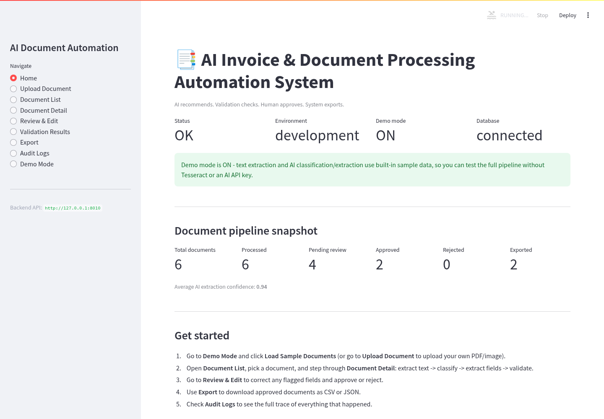
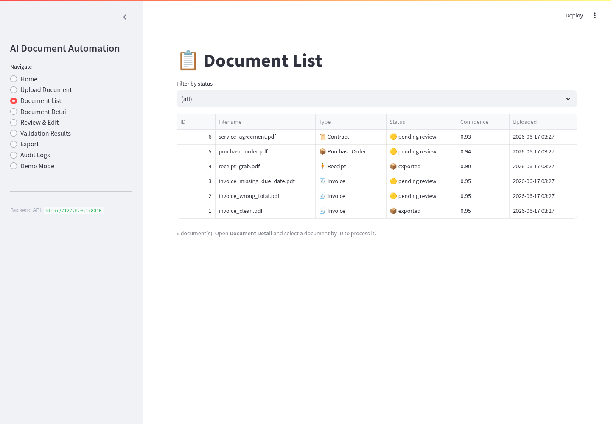
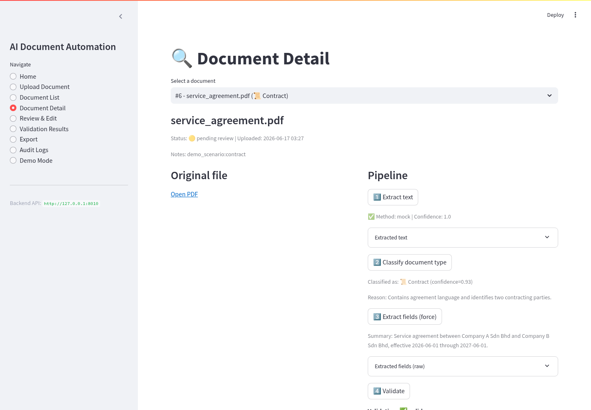
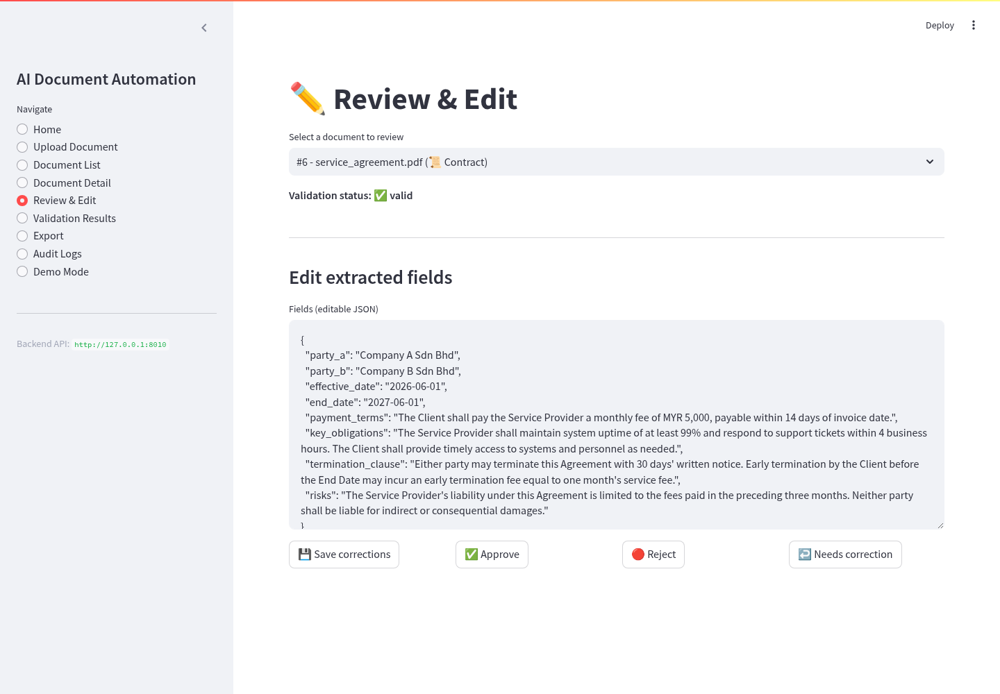
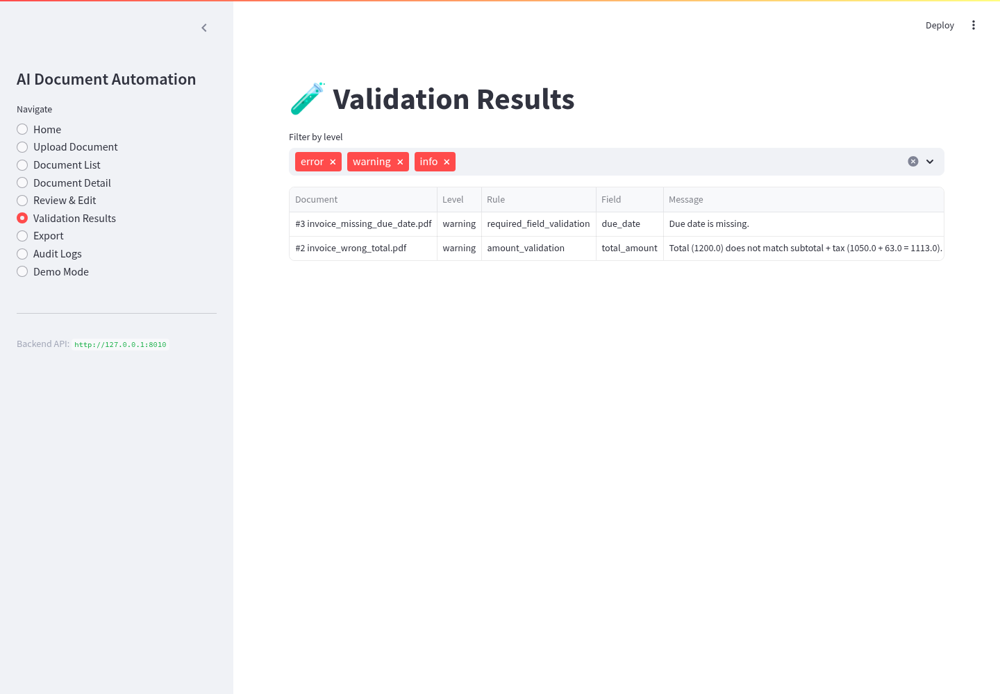
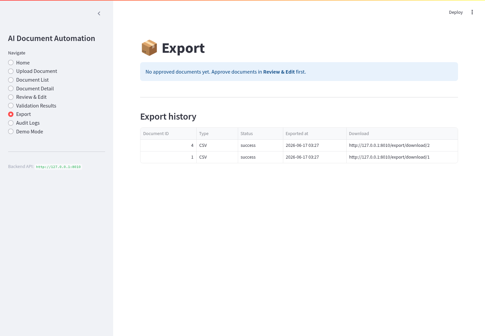
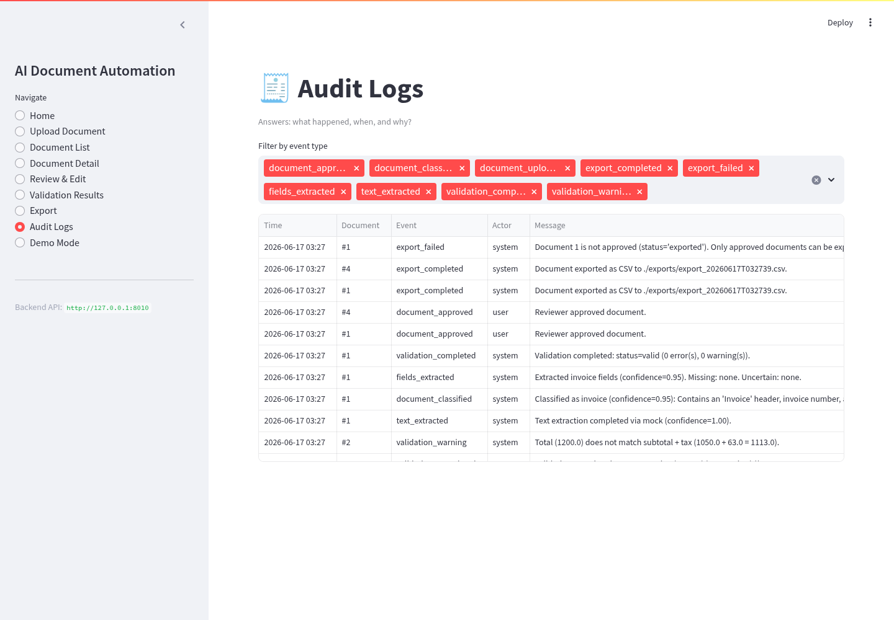
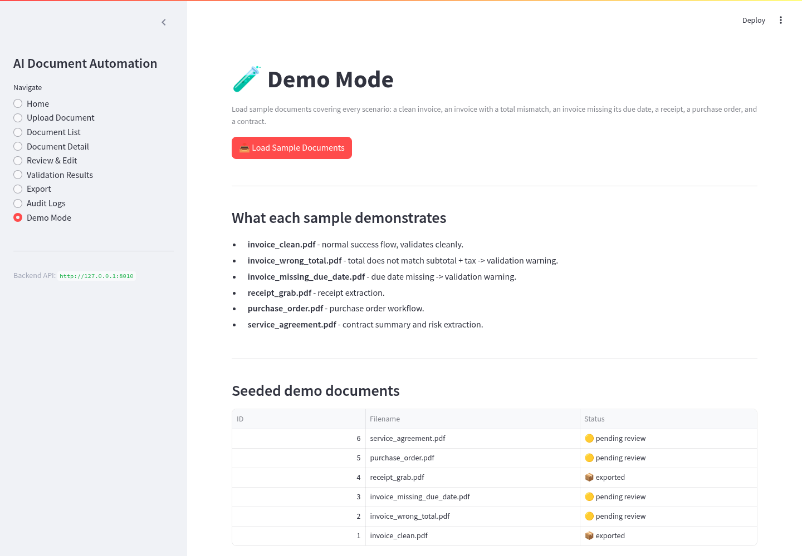
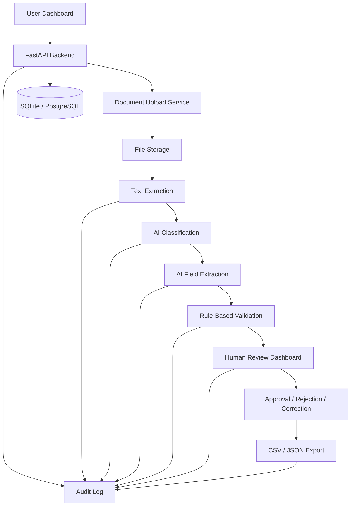

# AI Document Processing Automation System


> A human-in-the-loop AI document automation system that extracts text, classifies business documents, extracts structured fields, validates data, routes documents for review, exports approved records, and stores a complete audit trail.

This is not a simple OCR demo. It is a production-style AI workflow automation project built around a realistic business process:

```text
Document upload -> text extraction -> AI classification -> field extraction
-> rule-based validation -> human review -> approval -> export -> audit log
```

The system runs fully in demo mode with 6 seeded sample documents, mock AI extraction, SQLite, and zero external credentials. It is also structured for real PDF/OCR extraction, Anthropic Claude, PostgreSQL, Docker, and CI testing.

---

## Why this project matters

Many businesses still process invoices, receipts, purchase orders, and contracts manually. That creates slow review cycles, data-entry errors, missing fields, duplicate payments, weak auditability, and poor visibility into document status.

This project uses a safer automation pattern:

> AI extracts. Validation checks. Human approves. System exports. Everything is logged.

That makes it suitable for real business workflows where AI should support document operations without silently approving or exporting uncertain data.

---

## Core capabilities

| Area | What the system does |
| --- | --- |
| Document ingestion | Uploads PDF, PNG, JPG, and JPEG files with type, size, and empty-file validation |
| Demo seeding | Loads 6 realistic sample documents with zero credentials |
| Text extraction | Uses PDF text extraction, OCR-ready image handling, and demo-mode mock extraction |
| AI classification | Classifies invoices, receipts, purchase orders, contracts, or unknown documents |
| Field extraction | Extracts structured fields based on document type |
| Validation | Checks required fields, date logic, totals, currency, duplicates, and contract risk flags |
| Human review | Lets reviewers inspect, edit, approve, reject, or request correction |
| Export | Exports approved documents to CSV or JSON only after review |
| Auditability | Logs upload, extraction, classification, validation, edits, approval, rejection, export, and errors |
| Dashboard | Streamlit interface for documents, review, validation, export, audit log, and demo mode |
| API | FastAPI backend with Swagger documentation |
| Testing | 54 automated tests covering upload, extraction, validation, review, export, audit, and API workflow |
| Deployment | Docker and docker-compose support included |

---

## Screenshots

### Dashboard Overview


### Processed Document List


### Document Detail and Validation


### Human Review and Edit Warning


### Validation Results


### Export Page


### Audit Log


### Demo Mode Seeded Documents


### FastAPI Swagger Documentation


---

## Architecture



### Main components

| Component | Responsibility |
| --- | --- |
| `app/main.py` | FastAPI application entry point |
| `app/routers/` | API routes for documents, extraction, validation, review, export, dashboard metrics, and audit logs |
| `app/services/upload.py` | File upload validation and storage |
| `app/services/text_extraction.py` | PDF/image/mock text extraction |
| `app/services/ai_document.py` | AI classification and structured field extraction orchestration |
| `app/services/mock_document_ai.py` | Demo-mode classifier and extractor that works without API keys |
| `app/services/validation_engine.py` | Rule-based validation separate from AI output |
| `app/services/review.py` | Human review, edit, approve, reject, and correction workflow |
| `app/services/export.py` | Approved-only CSV/JSON export |
| `app/services/audit.py` | Traceable audit event logging |
| `dashboard/app.py` | Streamlit dashboard |
| `tests/` | Unit and integration tests |

---

## Document lifecycle

```text
uploaded -> text_extracted -> classified -> extracted -> pending_review
         -> needs_correction -> pending_review
         -> approved -> exported
         -> rejected
```

Approval is blocked when validation has unresolved error-level issues. Exports are blocked unless the document is approved.

---

## Supported document types

| Type | Key extracted fields |
| --- | --- |
| Invoice | vendor, invoice number, invoice date, due date, subtotal, tax, total, currency, payment terms, line items |
| Receipt | merchant, receipt number, transaction date, payment method, tax, total, currency, items |
| Purchase order | PO number, buyer, supplier, order date, delivery date, total, currency, line items |
| Contract | parties, effective date, end date, payment terms, obligations, termination clause, risk indicators |

---

## Validation rules

The validation engine is intentionally separate from AI extraction.

| Document type | Example checks |
| --- | --- |
| Invoice | required fields, due date not before invoice date, total equals subtotal plus tax, valid currency, duplicate invoice detection |
| Receipt | required merchant/date/total fields, positive total amount, valid currency |
| Purchase order | required PO fields, delivery date after order date, line-item total consistency, duplicate PO detection |
| Contract | parties identified, effective date present, missing payment terms, missing termination clause, risk summary flags |

Each issue is classified as `error`, `warning`, or `info`.

---

## Tech stack

| Layer | Tools |
| --- | --- |
| Backend | FastAPI, SQLAlchemy, Pydantic |
| Dashboard | Streamlit |
| Database | SQLite for local/demo, PostgreSQL-ready for production |
| AI | Anthropic Claude integration + mock document AI for demo mode |
| Extraction | PDF text extraction, OCR-ready image workflow |
| Export | CSV and JSON export |
| Testing | pytest, FastAPI TestClient |
| DevOps | Docker, docker-compose, GitHub Actions |

---

## Quick start on Windows

Use Python 3.12. Python 3.13 is not recommended for this project because pinned dependencies may fail during installation.

First-time setup:

```text
Double-click setup_windows.bat
```

Then run the app:

```text
1. Double-click start_backend.bat
2. Double-click start_dashboard.bat
```

Open:

```text
Dashboard: http://localhost:8501
API docs:  http://localhost:8000/docs
```

---

## Manual local setup

```bash
git clone https://github.com/SAHARIARSHOWMIK/ai-document-processing-automation.git
cd ai-document-processing-automation

python -m venv .venv
source .venv/bin/activate        # Windows PowerShell: .venv\Scripts\Activate.ps1

pip install -r requirements.txt
cp .env.example .env              # Windows: copy .env.example .env

uvicorn app.main:app --reload
```

In a second terminal:

```bash
source .venv/bin/activate        # Windows PowerShell: .venv\Scripts\Activate.ps1
pip install -r dashboard/requirements.txt
streamlit run dashboard/app.py
```

---

## Demo workflow

After opening the dashboard:

1. Go to **Demo Mode**.
2. Click **Load Sample Documents**.
3. Go to **Documents** and open a seeded document.
4. Run extraction, classification, field extraction, and validation.
5. Open **Review** and inspect or edit extracted fields.
6. Approve a valid document or request correction for problematic data.
7. Go to **Export** and export approved records as CSV or JSON.
8. Check **Audit Log** to see the full trace.

---

## API endpoints

| Method | Endpoint | Purpose |
| --- | --- | --- |
| `GET` | `/health` | Check app, database, and demo-mode status |
| `POST` | `/documents/upload` | Upload a PDF/image document |
| `GET` | `/documents` | List documents |
| `GET` | `/documents/{id}` | View full document detail |
| `GET` | `/documents/{id}/file` | Download or preview the original file |
| `POST` | `/documents/{id}/extract` | Run text extraction |
| `POST` | `/documents/{id}/classify` | Run AI classification |
| `POST` | `/documents/{id}/extract-fields` | Run structured field extraction |
| `POST` | `/documents/{id}/validate` | Run validation rules |
| `PATCH` | `/documents/{id}/fields` | Edit extracted fields and revalidate |
| `POST` | `/documents/{id}/approve` | Approve document for export |
| `POST` | `/documents/{id}/reject` | Reject document |
| `POST` | `/documents/{id}/request-correction` | Send document back for correction |
| `GET` | `/documents/{id}/approval` | Get approval status |
| `POST` | `/export/csv` | Export approved documents as CSV |
| `POST` | `/export/json` | Export approved documents as JSON |
| `GET` | `/export-logs` | View export history |
| `GET` | `/export/download/{id}` | Download an exported file |
| `GET` | `/dashboard/metrics` | Dashboard metrics |
| `GET` | `/audit-logs` | Audit trail |
| `POST` | `/demo/seed` | Load 6 sample demo documents |

Interactive documentation is available at:

```text
http://localhost:8000/docs
```

---

## Safety design

- The system does not approve documents automatically.
- Exports are blocked until a human approves the document.
- Validation is separate from AI extraction.
- Error-level validation issues block approval.
- Reviewer edits trigger revalidation.
- Demo mode works without real documents, AI credentials, or external accounts.
- `.env`, local databases, uploads, exports, and virtual environments are ignored by Git.

---

## Testing

Run:

```bash
pytest -v
```

Current verified test result:

```text
54 passed
```

The test suite covers:

- upload validation
- demo document seeding
- text extraction workflow
- AI classification and field extraction behavior
- validation rules
- human review and editing
- approval and rejection paths
- approved-only export enforcement
- audit logging
- API workflow integration

---

## Docker

```bash
docker compose up --build
```

This starts the backend, dashboard, and database stack. See [`docs/DEPLOYMENT.md`](docs/DEPLOYMENT.md) for deployment notes.

---

## Real OCR / AI configuration

The project runs in demo mode by default. To connect real services, update `.env`:

```env
DEMO_MODE=false
ANTHROPIC_API_KEY=your_anthropic_api_key
```

For OCR outside Docker, install Tesseract locally. Docker support includes OCR dependencies for containerized usage.

---

## Resume-ready summary

```text
Built a human-in-the-loop AI document processing automation system using FastAPI,
Streamlit, SQLAlchemy, OCR/PDF text extraction, structured LLM extraction,
validation rules, and CSV/JSON export.

Designed a safe document lifecycle that extracts invoice, receipt, purchase order,
and contract fields, validates business rules, blocks approval on errors, supports
human correction, exports only approved records, and records every operation in an
audit log.

Implemented demo mode, SQLite/PostgreSQL support, Docker deployment, Swagger API
documentation, CI-ready tests, and a recruiter-friendly dashboard with screenshots.
```

---

## License

MIT License. See [LICENSE](LICENSE).
